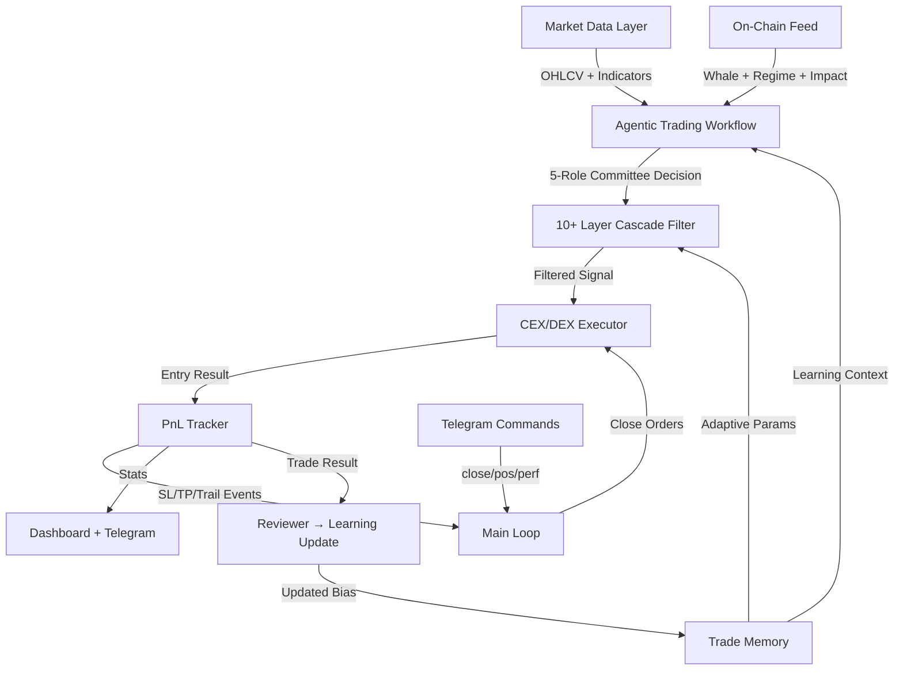

# 🏆 Meridian AI Quant Trading Bot — Capability Audit

> **Versi**: AI Quant Trading Bot v2.0  
> **Arsitektur**: Agentic Trading Workflow (5-Role Committee)  
> **Exchange**: Bybit Futures (CEX) + Hyperliquid (DEX)  
> **Bahasa**: Python 3, Fully Async  

---

## Arsitektur: Agentic Trading Workflow

Bot ini bukan signal generator biasa. Bot beroperasi sebagai **autonomous trading committee** dengan 5 role internal:

```
┌─────────────────────────────────────────────────────────────┐
│                    TRADING COMMITTEE                        │
├─────────────────────────────────────────────────────────────┤
│  1. SCOUT       → Scan market, cari setup potensial         │
│  2. ANALYST     → Analisa teknikal + fundamental            │
│  3. RISK MANAGER → Evaluasi risk/reward, reject jika jelek  │
│  4. POSITION MANAGER → Kelola entry/exit/SL/TP/trail        │
│  5. REVIEWER    → Belajar dari trade selesai, update bias   │
└─────────────────────────────────────────────────────────────┘
```

### Decision Hierarchy

1. **Hard risk rules** selalu override AI confidence
2. **Trade memory** override raw AI score
3. **SMC/retest quality** override momentum chasing
4. **High leverage** = higher quality confirmation needed
5. **High score TIDAK cukup** jika memory/setup jelek

### Key Principle

> "A high-confidence AI signal is only a proposal. It is not permission to trade. Permission comes only after memory, SMC, risk, and execution filters agree."

### Agentic Capabilities

- **Multi-timeframe analysis**: 4H primary, Daily HTF, 1H + 15M confirmation
- **Trade memory learning**: Belajar dari setiap trade, update bias per symbol
- **Adaptive risk mode**: Defensive → Conservative → Normal → Aggressive
- **SMC/ICT context**: Liquidity sweep, BOS, premium/discount, retest zones
- **Whale intelligence**: Smart money positioning + impact calculation
- **Committee decision**: Setiap keputusan melalui 5 tahap evaluasi

---

## Update Terbaru: ICT/SMC Retest + Memory Blacklist

Perbaikan terbaru menambah filter untuk dua masalah utama: AI telat entry dan bot mengulang entry pada symbol yang historis minus.

### ICT/SMC + Pullback/Retest Gate

Bot sekarang menghitung konteks objektif berbasis candle sebelum sinyal dieksekusi:

| Field | Fungsi |
|-------|--------|
| `swept_prev_high` / `swept_prev_low` | Deteksi buy-side/sell-side liquidity sweep |
| `bos_bullish` / `bos_bearish` | Break of Structure sederhana dari range terakhir |
| `premium_discount` | Posisi harga dalam range: premium / equilibrium / discount |
| `near_support` / `near_resistance` | Retest area S/R terdekat |
| `near_ema20` / `ema20_distance_pct` | Hindari entry terlalu jauh dari mean |
| `long_retest_zone` / `short_retest_zone` | Gate pullback/retest untuk LONG/SHORT |

Hard rule:
- **LONG** butuh sell-side sweep reclaim, bullish BOS, atau retest support/EMA20. Reject LONG di premium tanpa sweep/retest, RSI terlalu tinggi, dekat resistance tanpa BOS, atau terlalu jauh dari EMA20.
- **SHORT** butuh buy-side sweep reject, bearish BOS, atau retest resistance/EMA20. Reject SHORT di discount tanpa sweep/retest, RSI terlalu rendah, dekat support tanpa BOS, atau terlalu jauh dari EMA20.
- Breakout/breakdown tanpa rising volume atau retest akan ditolak sebagai late chase entry.

Operational note:
- `SMC_FILTER_MODE=soft` adalah default runtime terbaru agar gate ini tidak mematikan semua entry. Mode soft tetap menolak chase yang jelas, tetapi sinyal dengan score/confidence tinggi bisa melewati SMC warning. Pakai `SMC_FILTER_MODE=strict` untuk hard rule lama, atau `off` untuk debug sementara.

### Symbol Loss Protection

- `SYMBOL_LOSS_COOLDOWN_H` dinaikkan menjadi **12 jam** agar bot tidak cepat re-entry setelah symbol rugi.
- Manual blacklist ditambah: `GIGGLEUSDT`, `ORDIUSDT`, `ORCAUSDT`, `UBUSDT`.
- Memory blacklist gate: symbol dengan minimal 3 trade, total PnL negatif, dan WR < 40% akan hard-skip sebelum eksekusi, meski AI memberi sinyal valid.

Dengan update ini, pipeline screening efektif menjadi **9 layer**: AUTO_SYMBOLS, slot check, score/confidence, RR validation, anti-overtrading, risk filters, ICT/SMC retest gate, memory blacklist gate, dan P3 adaptive rules.

---

## Peringkat Kemampuan (Terbaik ke Standar)

### 🥇 1. Cascade Signal Screening (7-Layer Filter Pipeline)
**Rating: ★★★★★ — Best-in-Class**

Sistem filter berlapis yang sangat mature. Setiap sinyal AI harus melewati **7 gerbang** sebelum bisa masuk posisi:

| Layer | Nama | Fungsi |
|-------|------|--------|
| 1 | **AUTO_SYMBOLS** | Top-N by 24h volume dari Bybit → hanya koin liquid |
| 2 | **Slot Check** | Cek posisi terbuka, max concurrent positions |
| 3 | **Score + Confidence** | Hard floor (7.0 score, 65% conf) + adaptive elevation |
| 4 | **Risk/Reward** | TP1/SL ratio ≥ 1.2x, validasi arah TP vs market price |
| 5 | **Anti-Overtrading** | Max 3 trades/hari per simbol + loss cooldown 4 jam |
| 6 | **4 Risk Detection Filters** | Spread, wick anomaly, funding z-score, wash trading |
| 7 | **P3 Adaptive Rules** | Dynamic SL width, leverage cap, symbol WR penalty |

> Tambahan: **Blacklist**, **Data-Only symbols** (BTC sebagai bias anchor tanpa trading), **Daily Circuit Breaker** (halt entry saat daily loss > $8), **Signal Deduplication** (anti-hallucination AI).

---

### 🥈 2. AI Learning & Adaptive Risk System (Trade Memory)
**Rating: ★★★★★ — Sangat Canggih**

Sistem memori yang **belajar dari setiap trade** dan mengadaptasi behavior bot secara real-time:

- **4 Adaptive Modes**: `defensive` → `conservative` → `normal` → `aggressive`
- **Trigger otomatis**:
  - 5+ loss berturut ATAU weekly drawdown > 25% → **Defensive** (size 0.5x, min score 7.0, lev 0.6x)
  - 3 loss berturut ATAU WR < 35% → **Conservative** (size 0.7x, lev 0.8x)
  - 3+ win + WR > 65% + weekly profit → **Aggressive** (size 1.3x)
- **Learning Context Injection**: Bot menyuntikkan ~200-400 token *learning summary* ke system prompt AI di setiap scan, berisi:
  - History WR, streak, strong/weak symbols, good/bad setups
  - Per-symbol L/S preference hints (LONG win 80% vs SHORT win 20% → *prefer_L*)
- **Symbol Performance Penalty**: Simbol dengan WR < 40% (≥3 trades) → size otomatis dikurangi 30%

---

### 🥉 3. Hybrid Stop Loss (ATR Floor + ROI Cap)
**Rating: ★★★★★ — State-of-the-Art**

Sistem SL terbaru yang menggabungkan **perlindungan noise** dan **perlindungan modal**:

```
final_sl_dist = min(max(atr_floor, roi_default), roi_cap)
```

| Mode | ATR Floor | ROI Cap | Fungsi |
|------|-----------|---------|--------|
| Intraday | 1.5× ATR | -50% ROI | Cegah noise 15M tapi cap loss |
| Swing | 2.0× ATR | -75% ROI | Beri napas 4H candle tapi lindungi modal |

- **Safeguard**: Warning otomatis jika `atr_floor > roi_cap` (leverage terlalu tinggi untuk volatilitas koin)
- **DCA-compatible**: Saat DCA, SL di-recalculate dari avg entry baru

---

### 4. Multi-Tiered TP + Trailing Stop Management
**Rating: ★★★★★ — Best-in-Class**

Strategi exit 3-tahap yang sophisticated (UPDATE: wider TP & trailing):

| Event | Aksi |
|-------|------|
| **TP1 hit** (3× ATR) | 25% partial close + SL → Breakeven + profit lock (10% ROI) + trailing aktif |
| **TP2 hit** (5× ATR) | 25% partial close + SL advance ke TP1 + trail tetap lebar |
| **TP3 hit** (7-10× ATR) | 100% full close |
| **Trail hit** | Dynamic trailing (3× ATR swing / 2.5× ATR intraday), biarkan winner jalan |

- **Fee Protection**: Partial close SKIP jika TP move < 0.20% (net negative setelah fees)
- **BE Profit Lock**: SL di BE bukan exact entry, tapi entry + 10% ROI (cover fees + lock gain)
- **No Trail Tightening**: Trail tidak dikurangi setelah TP1/TP2 — biarkan winner jalan lebih jauh

---

### 5. On-Chain / Whale Intelligence (Smart Money Layer)
**Rating: ★★★★★ — Best-in-Class**

Data layer yang mengumpulkan **5 sumber data whale** secara paralel + **Whale Impact Calculator**:

| Sumber | Proxy Untuk |
|--------|-------------|
| **Position Ratio** (Binance) | Smart Money positioning (size-weighted, PRIMARY) |
| **Account Ratio** (Binance) | Top-trader headcount |
| **Taker Buy/Sell Ratio** | Aggressive momentum |
| **Fear & Greed Index** | Market regime / sentiment cycle |
| **Liquidation Cascade** (Binance + OKX fallback) | Squeeze / cascade risk |
| **OI Change** (Bybit) | New positions opened/closed |
| **Price Change 24h** (Bybit) | Price direction confirmation |

- **Composite Score**: Weighted formula (pos_ratio 2x > acct 1x > F&G 1x > taker 0.5x)
- **Smart Money Rotation Detector**: Per-symbol inflow score vs BTC baseline → deteksi rotasi
- **Per-Symbol Whale Metrics**: Parallel fetch up to 10 symbols → accumulating/distributing flags
- **Mode-Adaptive**: Swing = 4h period (stable), Intraday = 1h period (reactive)
- **Whale Impact Calculator** (NEW): Hitung impact whale ke harga berdasarkan OI + taker + price change
  - **stealth_accumulation**: OI naik + taker buy + harga turun = strongly_bullish (whale beli diam-diam)
  - **whale_accumulation**: OI naik + taker buy + harga naik = bullish
  - **distribution_top**: OI naik + taker sell + harga naik = strongly_bearish (whale jual diam-diam)
  - **whale_distribution**: OI naik + taker sell + harga turun = bearish
  - **short_squeeze**: OI turun + harga naik tajam = bullish
  - **long_liquidation**: OI turun + harga turun tajam = bearish
- **Score Modifier**: Whale impact langsung mempengaruhi signal score (+1.5 sampai -1.0)

---

### 6. Multi-Provider AI Engine (3-Tier Fallback)
**Rating: ★★★★☆ — Sangat Baik**

Arsitektur AI yang robust dengan **3 tier failover**:

```
Tier-1 (Primary) → Tier-2 (Fallback) → Tier-3 (2nd Fallback)
```

- **8 Provider Support**: Anthropic, OpenAI, Gemini, Qwen (OpenRouter), Blink, GLM, MiniMax, Custom
- **Per-Tier Override**: Model/key/URL bisa berbeda per tier
- **Scoring System**: 10-kategori scoring (max ~14.5 poin) dengan formula eksplisit
- **Anti-Flip Rule**: Signal continuity — prevent flip-flop dalam 4H candle yang sama
- **Anti-HOLD-Loop**: Jika semua prev signal = HOLD score=0, prev TIDAK di-inject ke scan berikutnya (mencegah AI terus HOLD karena melihat prev=HOLD)
- **Anti-Laziness Prompt**: AI DILARANG kasih score=0 identik ke semua symbol. Bear market = SHORT expected, bull = LONG expected
- **Lazy Detection + Auto-Retry**: Jika >70% reason identik + semua score=0, otomatis retry dengan RETRY WARNING prompt
- **BTC Global Bias**: AI menerima BTC data sebagai anchor untuk alt decision
- **Multi-Symbol Batch**: Satu prompt menganalisis semua simbol sekaligus, ranked by score

---

### 7. Interactive DCA (Dollar Cost Averaging) via Telegram
**Rating: ★★★★☆ — Sangat Baik**

Bukan auto-DCA, tapi **human-in-the-loop**:

- **Trigger**: ROI mencapai -75% (default, configurable)
- **Mekanisme**: Bot kirim pertanyaan ke Telegram → user reply Y/N
- **Y**: Execute DCA, hitung avg entry baru, update SL dari avg entry
- **N**: Set `dca_declined` flag → tidak ditanya lagi untuk posisi ini
- **Timeout**: Tidak set flag, tanya lagi scan berikutnya
- **Max 1 DCA per posisi**

---

### 8. Quick-Exit on Reversal (P3)
**Rating: ★★★★☆ — Baik**

Force close saat semua indikator teknikal berbalik:

- **4 Kondisi Wajib** (semua harus true):
  1. Posisi ≥ 1 jam (anti-premature)
  2. RSI flip (LONG: RSI < 35, SHORT: RSI > 65)
  3. Market structure flip (uptrend → bearish, atau sebaliknya)
  4. Posisi **harus profit** (safety floor — lock gain, bukan panic sell)
- Kirim notifikasi Telegram + record ke TradeMemory

---

### 9. Live Position Sync (Bybit Reconciliation)
**Rating: ★★★★☆ — Baik**

Setiap scan, bot mencocokkan `pnl_store.json` dengan posisi aktual Bybit:

- **Orphan Detection**: Posisi di Bybit tanpa record bot → tambahkan + auto-attach SL (safety)
- **Ghost Detection**: Record bot tanpa posisi Bybit → mark closed (ambil PnL dari closedPnL API)
- **Update Sync**: Entry/leverage di-update ke nilai aktual Bybit
- **Cooldown**: 30s cooldown setelah close agar sync tidak re-add posisi yang baru ditutup

---

### 10. Telegram Bot (Bidirectional Command + Alert)
**Rating: ★★★★☆ — Baik**

Bukan hanya notifikasi, tapi **two-way control**:

| Command | Fungsi |
|---------|--------|
| `close SYMBOL PCT` | Partial/full close posisi (contoh: `close sirenusdt 25`) |
| `positions` / `pos` | List posisi terbuka |
| `perf` / `stats` | Performance breakdown by AI tier + symbol |
| `help` | Daftar command |

- **Alert Types**: Signal, Execution, PnL Close, Error, DCA Prompt, Time-Exit Prompt, BE/SL advance milestones
- **Interactive Y/N**: Untuk DCA dan Time-Exit decisions

---

### 11. Time-Based Exit System (P1)
**Rating: ★★★☆☆ — Baik**

Prevent "posisi zombie" yang stagnan:

| Trigger | Kondisi | Aksi |
|---------|---------|------|
| **Stagnant Exit** | ≥ 6 jam + \|ROI\| < 5% + *losing* | Tanya user via Telegram |
| **Max Hold** | ≥ 12h (intraday) / 24h (swing) + *losing* | Tanya user via Telegram |

- **TIDAK auto-close** — user decision (Y/N/timeout)
- **Profitable positions**: NEVER prompted (biarkan trail/TP handle)
- **Cooldown 6h** setelah user jawab N, agar tidak spam

---

### 12. Pro Dashboard (Terminal + Web + HTML Report)
**Rating: ★★★☆☆ — Baik**

3 interface monitoring:

| Interface | Fitur |
|-----------|-------|
| **Terminal Dashboard** | ANSI-colored, real-time: balance, PnL, positions, signals, data sources |
| **Flask Web Dashboard** | `localhost:5050`, API endpoint, Bybit chart integration, 14-day PnL chart |
| **HTML Performance Report** | `bot_performance.html`, equity curve, daily PnL bar, symbol breakdown, Chart.js |

- **Daily Telegram Report**: Auto-send metrics jam 07:00 WIB
- **Performance Breakdown**: By AI tier + by symbol (diagnose which AI/symbol profitable)

---

### 13. Dual Exchange Support (CEX + DEX)
**Rating: ★★★☆☆ — Baik**

| Exchange | Mode | Fitur |
|----------|------|-------|
| **Bybit** (CEX) | Futures USDT-M | Full SL/TP/trail management, partial close, DCA, leverage set |
| **Hyperliquid** (DEX) | USDC Perps | IoC entry, trigger SL/TP, market close |

- **Dry Run Mode**: Simulasi penuh tanpa real order → safe testing
- **Dynamic Symbol Discovery**: Auto-fetch top-N by volume, refresh tiap 4h

---

### 14. Multi-Timeframe Market Data
**Rating: ★★★☆☆ — Baik**

Data layer yang fetch 4 timeframe secara komprehensif:

| Mode | Primary | HTF | Confirmation |
|------|---------|-----|-------------|
| **Swing** | 4H (EMA, RSI, structure) | Daily (bias, RSI) | 1H + 15M |
| **Intraday** | 15M | 1H + 4H | 5M entry timing |

- **30+ Indikator**: EMA20/50/200, RSI, volume condition, market structure, ATR%, funding rate, OI, S/R levels, spread, wick anomaly, funding z-score, wash trading detection
- **Multi-Source Fallback**: Bybit primary → OKX → Gate.io

---

### 15. Utility & Maintenance Tools
**Rating: ★★★☆☆ — Standar**

| Tool | Fungsi |
|------|--------|
| `recount_stats.py` | Rekalkulasi stats dari closed_trades (fix desync) |
| `rollback_false_close.py` | Rollback false close |
| `fix_dash_pnl.py` | Fix dashboard PnL data |
| `inject_sl_tp.py` | Inject SL/TP ke posisi existing |
| `report_generator.py` | Generate HTML report standalone |

---

## Ringkasan Arsitektur



## Total: 16 Sistem Utama

| Tier | Kemampuan |
|------|-----------|
| **S-Tier** | Agentic Trading Workflow, Cascade Screening, AI Learning/Adaptive, Hybrid SL |
| **A-Tier** | TP/Trail Management, Whale Intelligence + Impact, Multi-AI Fallback, DCA, Quick-Exit, Live Sync, Telegram Control |
| **B-Tier** | Time-Exit, Dashboard, Dual Exchange, MTF Data, Utility Tools |
