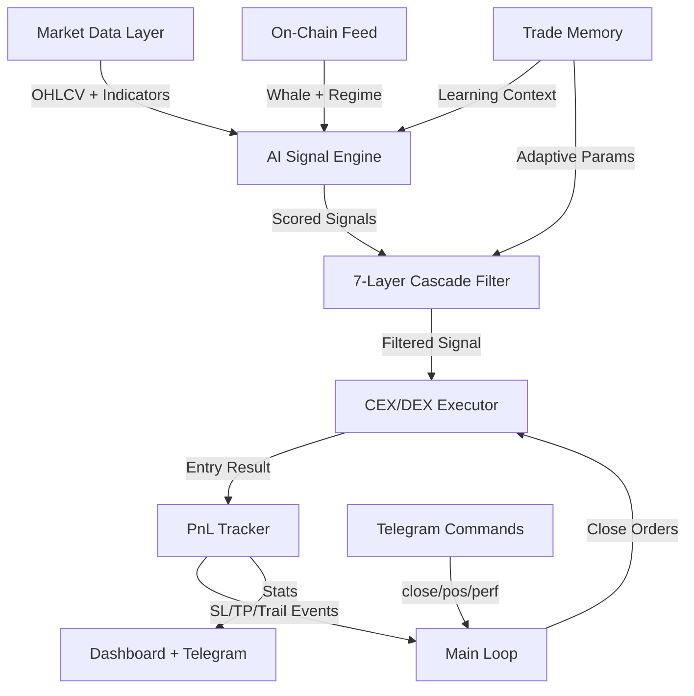

# Meridian AI Quant Trading Bot - Capability Audit

> **Version**: AI Quant Trading Bot v2.0  
> **Architecture**: 4-layer system: Data -> Analyzer -> Execution -> Tracking  
> **Exchange Support**: Bybit Futures (CEX) and Hyperliquid (DEX)  
> **Language**: Python 3, fully async  

---

## Latest Update: ICT/SMC Retest + Memory Blacklist

The latest update adds protection against two recurring problems: late AI entries and repeated entries on symbols with poor historical performance.

### ICT/SMC + Pullback/Retest Gate

Before a signal can be executed, the bot now calculates objective candle-based context:

| Field | Purpose |
|-------|---------|
| `swept_prev_high` / `swept_prev_low` | Detects buy-side or sell-side liquidity sweeps |
| `bos_bullish` / `bos_bearish` | Simple break of structure from the recent range |
| `premium_discount` | Classifies current price as premium, equilibrium, or discount |
| `near_support` / `near_resistance` | Detects retests of nearby support or resistance |
| `near_ema20` / `ema20_distance_pct` | Avoids entries too far from the mean |
| `long_retest_zone` / `short_retest_zone` | Pullback/retest gate for LONG and SHORT setups |

Strict mode (`SMC_FILTER_MODE=strict`):

- **LONG** needs a sell-side sweep reclaim, bullish BOS, or support/EMA20 retest.
- Reject LONG in premium without sweep/retest, with overheated RSI, near resistance without BOS, or too far above EMA20.
- **SHORT** needs a buy-side sweep rejection, bearish BOS, or resistance/EMA20 retest.
- Reject SHORT in discount without sweep/retest, with oversold RSI, near support without BOS, or too far below EMA20.
- Breakouts/breakdowns without rising volume or retest are rejected as late chase entries.

Runtime defaults:

- `SMC_FILTER_MODE=soft` so the gate does not block every setup.
- Soft mode still rejects clear chase entries, but high-conviction signals can bypass SMC warnings when `score >= 8.2` and `confidence >= 0.72`.
- Use `SMC_FILTER_MODE=strict` for hard rules, or `SMC_FILTER_MODE=off` for temporary debugging.

VPS deployment notes:

- Required files to upload: `main.py`, `config.py`, and `.env`.
- If the VPS `.env` has different live API keys or production settings, do not overwrite the whole file. Add only:

```env
SMC_FILTER_MODE=soft
SMC_SOFT_BYPASS_SCORE=8.2
SMC_SOFT_BYPASS_CONFIDENCE=0.72
```

- Optional files: `bot_capabilities.md` for documentation and `env.example` for a template.
- Restart the VPS service/process after upload so the new config is loaded.

### Symbol Loss Protection

- `SYMBOL_LOSS_COOLDOWN_H` is increased to **12 hours** to prevent fast re-entry after a symbol loses.
- Manual blacklist includes `GIGGLEUSDT`, `ORDIUSDT`, `ORCAUSDT`, and `UBUSDT`.
- Memory blacklist gate hard-skips a symbol before execution if it has at least 3 trades, negative total PnL, and win rate below 40%, even when AI gives a valid signal.

With this update, the effective screening pipeline has **9 layers**: AUTO_SYMBOLS, slot check, score/confidence, RR validation, anti-overtrading, risk filters, ICT/SMC retest gate, memory blacklist gate, and P3 adaptive rules.

---

## Capability Ranking

### 1. Cascade Signal Screening (7-Layer Filter Pipeline)

**Rating: 5/5 - Best-in-class**

A mature multi-layer filter. Every AI signal must pass several gates before the bot can open a position:

| Layer | Name | Purpose |
|-------|------|---------|
| 1 | **AUTO_SYMBOLS** | Selects top-N symbols by 24h volume; focuses on liquid markets |
| 2 | **Slot Check** | Enforces maximum concurrent positions |
| 3 | **Score + Confidence** | Hard floor plus adaptive elevation |
| 4 | **Risk/Reward** | Validates TP1/SL ratio and TP direction vs market price |
| 5 | **Anti-Overtrading** | Limits trades per symbol/day and applies loss cooldown |
| 6 | **Risk Detection Filters** | Spread, wick anomaly, funding z-score, and wash trading checks |
| 7 | **P3 Adaptive Rules** | Dynamic SL width, leverage cap, and symbol win-rate penalty |

Additional protections include blacklist support, data-only symbols such as BTC for bias anchoring, daily circuit breaker, and signal deduplication to reduce AI hallucination risk.

---

### 2. AI Learning & Adaptive Risk System (Trade Memory)

**Rating: 5/5 - Advanced**

The bot learns from completed trades and adapts risk behavior in real time:

- **4 adaptive modes**: `defensive`, `conservative`, `normal`, and `aggressive`.
- Automatic triggers:
- 5+ consecutive losses or weekly drawdown above 25% -> defensive mode.
- 3 consecutive losses or win rate below 35% -> conservative mode.
- 3+ wins, win rate above 65%, and weekly profit -> aggressive mode.
- Learning context injection: every scan includes a compact learning summary in the AI prompt.
- The summary includes win rate, streak, strong/weak symbols, good/bad setup patterns, and per-symbol long/short preference hints.
- Symbol performance penalty: symbols with win rate below 40% after at least 3 trades get automatic size reduction.

---

### 3. Hybrid Stop Loss (ATR Floor + ROI Cap)

**Rating: 5/5 - State-of-the-art**

The stop-loss system balances noise tolerance and capital protection:

```text
final_sl_dist = min(max(atr_floor, roi_default), roi_cap)
```

| Mode | ATR Floor | ROI Cap | Purpose |
|------|-----------|---------|---------|
| Intraday | 1.5x ATR | -50% ROI | Avoid 15M noise while capping loss |
| Swing | 2.0x ATR | -75% ROI | Gives 4H candles room while protecting capital |

- Automatic warning when `atr_floor > roi_cap`, usually meaning leverage is too high for the symbol volatility.
- DCA-compatible: after DCA, SL is recalculated from the new average entry.

---

### 4. Multi-Tiered TP + Trailing Stop Management

**Rating: 4/5 - Very good**

The exit system uses staged profit taking and dynamic trailing:

| Event | Action |
|-------|--------|
| **TP1 hit** | Close 30%, move SL to breakeven plus profit lock, enable trailing |
| **TP2 hit** | Close another 30%, advance SL to TP1, tighten trailing |
| **TP3 hit** | Full close |
| **Trail hit** | Dynamic trailing close using ATR and leverage-scaled caps |

- Fee protection: partial close is skipped if the TP move is too small to beat fees.
- Breakeven lock is not exact entry; it includes a small profit buffer to cover fees and lock gain.

---

### 5. On-Chain / Whale Intelligence (Smart Money Layer)

**Rating: 4/5 - Very good**

The on-chain layer aggregates whale and regime data from multiple sources:

| Source | Proxy For |
|--------|-----------|
| **Position Ratio** | Smart money positioning, size-weighted |
| **Account Ratio** | Top-trader participation |
| **Taker Buy/Sell Ratio** | Aggressive flow and momentum |
| **Fear & Greed Index** | Market regime and sentiment cycle |
| **Liquidation Cascade** | Squeeze or cascade risk |

- Composite score prioritizes position ratio over account ratio, sentiment, and taker flow.
- Smart money rotation detector compares per-symbol inflow against BTC baseline.
- Per-symbol whale metrics are fetched in parallel for up to 10 symbols.
- Mode adaptive: swing uses longer periods, intraday uses shorter periods.

---

### 6. Multi-Provider AI Engine (3-Tier Fallback)

**Rating: 4/5 - Very good**

The AI engine supports provider failover:

```text
Tier 1 primary -> Tier 2 fallback -> Tier 3 second fallback
```

- Supports Anthropic, OpenAI, Gemini, Qwen/OpenRouter, Blink, GLM, MiniMax, and custom providers.
- Per-tier model, key, and base URL overrides.
- Explicit multi-category scoring system.
- Anti-flip rule to prevent direction flip-flopping inside the same 4H candle.
- Anti-HOLD-loop logic prevents stale all-HOLD signals from poisoning the next scan.
- Anti-laziness prompt tells the AI not to assign identical zero scores to every symbol.
- Lazy detection and auto-retry when reasons are too repetitive and all scores are zero.
- BTC global bias is included as an anchor for altcoin decisions.
- Multi-symbol batch prompt ranks all symbols in one AI pass.

---

### 7. Interactive DCA via Telegram

**Rating: 4/5 - Very good**

The bot uses human-in-the-loop DCA instead of fully automatic DCA:

- Trigger: configurable negative ROI threshold.
- The bot sends a Telegram prompt and waits for Y/N.
- `Y`: executes DCA, recalculates average entry, and updates SL.
- `N`: sets `dca_declined` so the bot does not ask again for that position.
- Timeout: no flag is set; the bot can ask again on the next scan.
- Maximum one DCA per position.

---

### 8. Quick-Exit on Reversal (P3)

**Rating: 4/5 - Good**

The bot can force close when technical conditions reverse:

- Position age must be at least 1 hour.
- RSI must flip against the position.
- Market structure must flip.
- Position must be profitable, so the rule locks gains rather than panic-closing losses.
- Sends Telegram notification and records the result in trade memory.

---

### 9. Live Position Sync (Bybit Reconciliation)

**Rating: 4/5 - Good**

Every scan reconciles local PnL records against live Bybit positions:

- Orphan detection: Bybit position without local record -> add record and auto-attach SL.
- Ghost detection: local record without Bybit position -> mark closed and fetch closed PnL.
- Update sync: entry and leverage are updated to actual Bybit values.
- Cooldown after close prevents recently closed positions from being re-added immediately.

---

### 10. Telegram Bot (Bidirectional Commands + Alerts)

**Rating: 4/5 - Good**

Telegram is used for both alerts and control:

| Command | Purpose |
|---------|---------|
| `close SYMBOL PCT` | Partial or full close, for example `close sirenusdt 25` |
| `positions` / `pos` | List open positions |
| `perf` / `stats` | Performance breakdown by AI tier and symbol |
| `help` | Command list |

Alert types include signal, execution, PnL close, error, DCA prompt, time-exit prompt, and SL/BE advancement milestones.

---

### 11. Time-Based Exit System (P1)

**Rating: 3/5 - Good**

Prevents stagnant zombie positions:

| Trigger | Condition | Action |
|---------|-----------|--------|
| **Stagnant Exit** | Held long enough, low absolute ROI, and losing | Ask user via Telegram |
| **Max Hold** | Max hold time reached and losing | Ask user via Telegram |

- No automatic close; user decides through Telegram.
- Profitable positions are never prompted and are left to TP/trailing logic.
- Cooldown prevents repeated spam after user declines.

---

### 12. Pro Dashboard (Terminal + Web + HTML Report)

**Rating: 3/5 - Good**

The bot includes three monitoring interfaces:

| Interface | Features |
|-----------|----------|
| **Terminal Dashboard** | ANSI-colored live balance, PnL, positions, signals, and data sources |
| **Flask Web Dashboard** | Local web UI, API endpoint, Bybit chart integration, PnL chart |
| **HTML Performance Report** | Equity curve, daily PnL bars, symbol breakdown, Chart.js |

- Daily Telegram report can be sent automatically.
- Performance breakdown helps diagnose which AI tier or symbol is profitable.

---

### 13. Dual Exchange Support (CEX + DEX)

**Rating: 3/5 - Good**

| Exchange | Mode | Features |
|----------|------|----------|
| **Bybit** | USDT-M futures | Full SL/TP/trail management, partial close, DCA, leverage setting |
| **Hyperliquid** | USDC perps | IOC entry, trigger SL/TP, market close |

- Dry-run mode provides full simulation without real orders.
- Dynamic symbol discovery fetches top symbols by volume and refreshes periodically.

---

### 14. Multi-Timeframe Market Data

**Rating: 3/5 - Good**

The data layer fetches multiple timeframes depending on trading mode:

| Mode | Primary | Higher Timeframe | Confirmation |
|------|---------|------------------|--------------|
| **Swing** | 4H | Daily | 1H + 15M |
| **Intraday** | 15M | 1H + 4H | 5M entry timing |

- Indicators include EMA20/50/200, RSI, volume condition, market structure, ATR%, funding rate, OI, S/R levels, spread, wick anomaly, funding z-score, and wash trading detection.
- Multi-source fallback: Bybit primary, then OKX, then Gate.io.

---

### 15. Utility & Maintenance Tools

**Rating: 3/5 - Standard**

| Tool | Purpose |
|------|---------|
| `recount_stats.py` | Recalculate stats from closed trades and fix desync |
| `rollback_false_close.py` | Roll back false close records |
| `fix_dash_pnl.py` | Fix dashboard PnL data |
| `inject_sl_tp.py` | Inject SL/TP into existing positions |
| `report_generator.py` | Generate standalone HTML performance report |

---

## Architecture Summary



## Total: 15 Major Systems

| Tier | Capabilities |
|------|--------------|
| **S-Tier** | Cascade screening, AI learning/adaptive risk, hybrid stop loss |
| **A-Tier** | TP/trailing management, whale intelligence, multi-AI fallback, DCA, quick-exit, live sync, Telegram control |
| **B-Tier** | Time exit, dashboard, dual exchange support, MTF data, utility tools |
